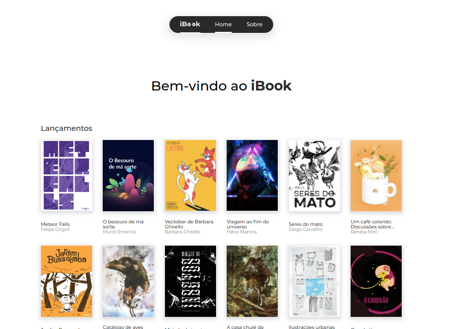
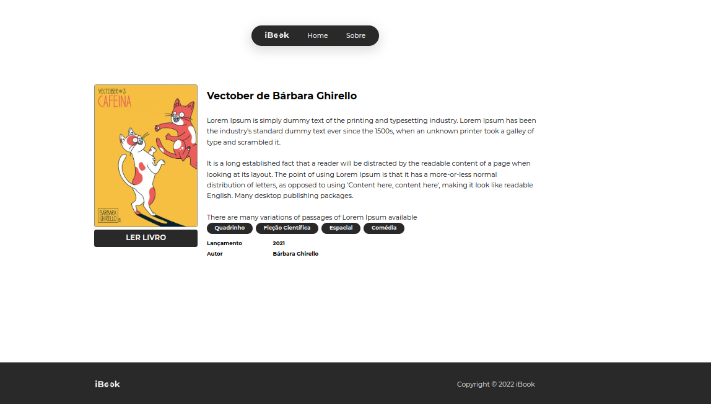

<!---->
<div align="center">

</div>
<div align="center">

</div>

# Ibook - Plataforma de leitura online para livros digitais

<p>Esse projeto foi feito por: <strong>Marcio Oliveira (mod64)</strong>, em 07/2022.</br>
Tendo como base, as aulas de Escalando Vue com Nuxt, no Bootcamp Full Stack da <a href="https://bootcamp.cataline.io/">Cataline</a>.

## Demo: https://ibook-nuxt.vercel.app

### ⚠ Esse projeto possui um API separada do aplicativo❗❗❗ Sendo assim, caso queira rodar esse app localmente, clone a API no repositório:

https://github.com/Thiagoow/API-JsonServer-iBook-ThiagoSilvaLopes </br>

##### Para instalar o projeto localmente, com a pasta "node_modules":

```
yarn install
```

##### Para compilar/executar o projeto localmente:

```
yarn dev
```
